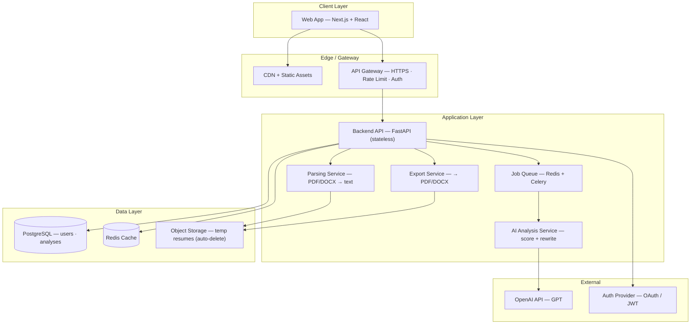
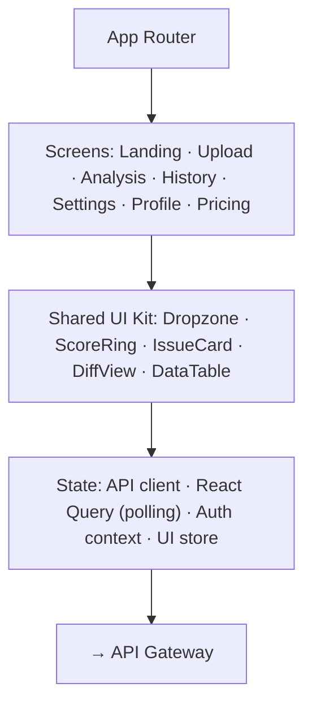
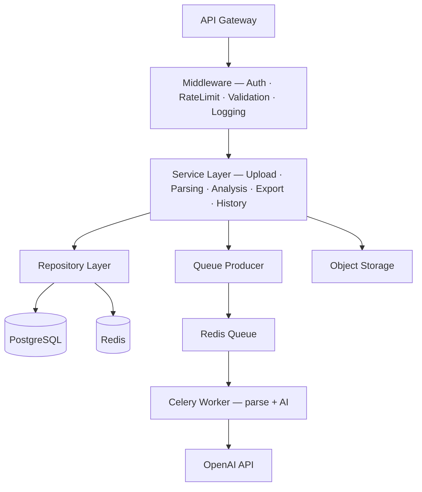
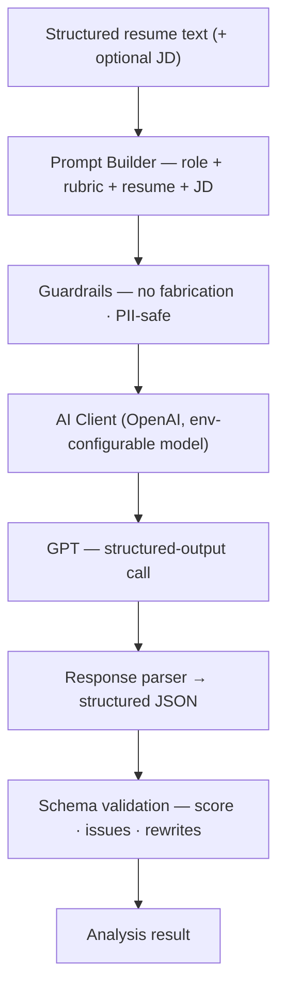
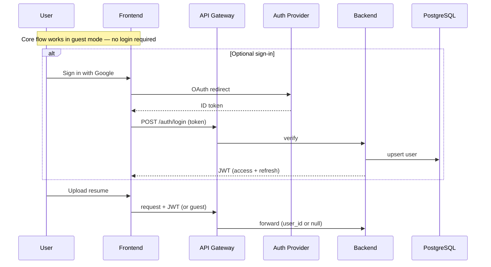
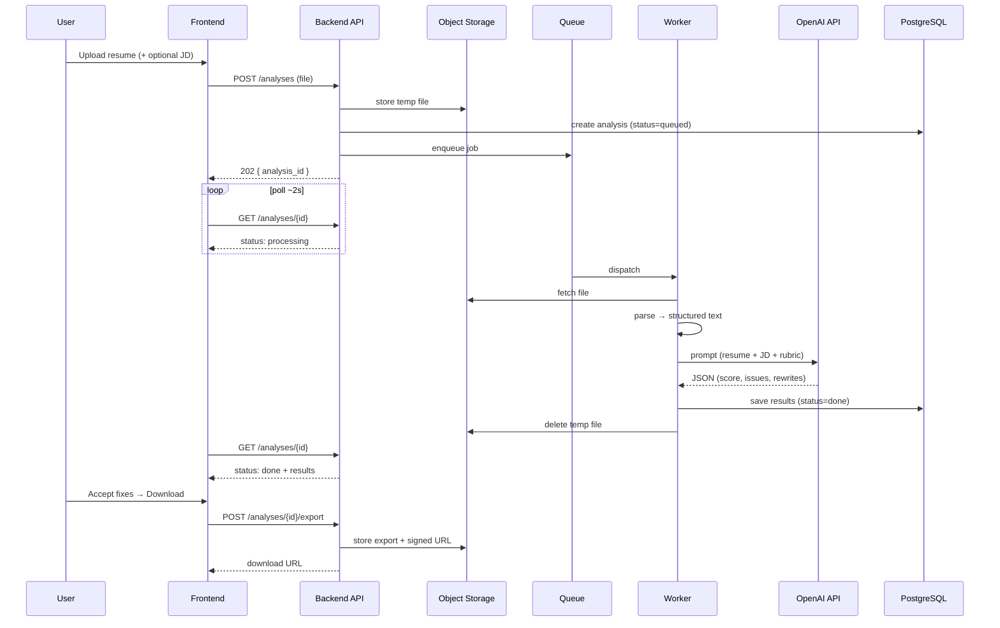
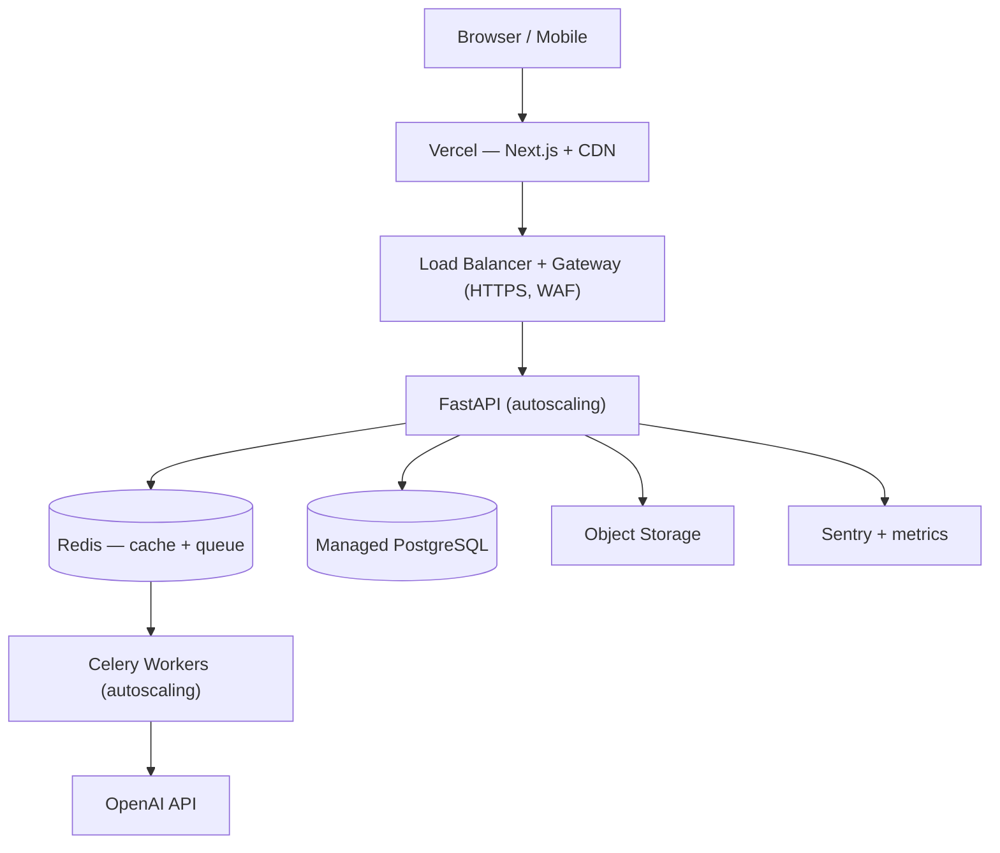
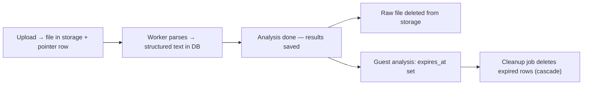

# ResumeIQ — System Architecture

**Status:** Draft v1 · **Last updated:** 2026-07-11

This document describes how ResumeIQ fits together, layer by layer. It reflects the intended design; sections marked _(planned)_ are not yet implemented. Rationale for the technology choices lives in [decisions.md](decisions.md).

---

## 1. Design Principles

1. **Guest-first.** The core flow (upload → analyze → download) requires no login. Friction kills fresher adoption.
2. **Stateless API.** The API tier holds no session state, so it scales horizontally during placement-season traffic spikes.
3. **Async for heavy work.** Parsing and AI calls run as queued jobs, keeping the API responsive and resilient to slow AI responses.
4. **Privacy-first.** Resumes are PII. Raw files are transient, encrypted, never logged, and auto-deleted after processing.
5. **Model-agnostic AI.** The LLM sits behind an abstraction so the model can be swapped or upgraded without touching business logic.

---

## 2. System Overview

---

## 3. Frontend

Next.js (App Router) + TypeScript + Tailwind. Guest-first, mobile-responsive, with polling for async analysis progress.

Key decisions: server state via React Query with polling for the queued analysis job; a themeable design-token system for light/dark mode.

---

## 4. Backend

A modular FastAPI application (a modular monolith that can be split into services later). Requests pass through middleware (auth, rate limiting, validation, logging) into a service layer, which talks to data via a repository layer. Heavy work is handed to a Celery worker via a Redis queue.

---

## 5. AI Service

The intelligence core, isolated behind a single `analyzer` module so the model or provider can change without touching the rest of the app.

- **Structured output:** the model is forced to return validated JSON (score, issues, rewrites) via OpenAI structured outputs — no fragile text parsing.
- **One schema, no drift:** the same Pydantic model is the API contract *and* the AI output schema (see [decisions.md](decisions.md) ADR-005).
- **Swappable:** the provider lives in one module and the model id is an env var, so switching model/provider is a localized change.
- **Guardrails:** scores real content only — no invented experience.
- **Cost control:** token caps + caching of identical requests (planned).

---

## 6. Data Layer

- **PostgreSQL** — users, analyses, issues, rewrites, exports, job matches. Structured results, not raw files. Full schema in _docs/database.md (planned)_.
- **Redis** — cache + job queue broker.
- **Object Storage (S3/GCS)** — transient resume uploads and generated exports, accessed via short-TTL signed URLs, with lifecycle auto-delete.

---

## 7. Authentication

Guest-first; OAuth (Google) + JWT for users who want saved history.

---

## 8. End-to-End Request Flow

The full happy path with async analysis:

---

## 9. Deployment _(planned)_

| Concern | Approach |
|---------|----------|
| Frontend | Vercel (CDN, preview deploys) |
| API / workers | Containers on a managed platform → orchestrated at scale |
| Scaling | Stateless API + workers scale on CPU / queue depth |
| Data | Managed Postgres (backups, replica), managed Redis |
| Security | HTTPS, WAF, secrets manager, least-privilege IAM |
| CI/CD | Push → build → test → deploy (rolling) |
| Monitoring | Sentry + funnel & latency metrics |

---

## 10. Data Lifecycle & Privacy

Raw resume files are transient; only structured results persist. Guest data expires automatically. No raw PII is written to logs.
